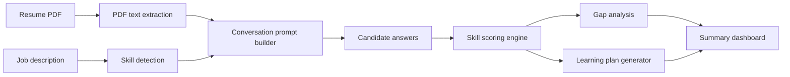

# Architecture Overview

## System flow

The prototype is built as a small, deterministic Streamlit app with a local analysis engine.

## Components

### Streamlit UI

The UI handles file upload, job description input, one-question-at-a-time assessment, and report download.

### Assessment engine

`assessment_engine.py` owns three jobs:

- Extract resume text from the uploaded PDF.
- Detect required skills in the job description using a curated skill library and aliases.
- Score each answer using resume evidence, practical detail, and skill-specific keywords.

### Learning plan generator

When a gap is detected, the engine picks adjacent skills that are already present in the candidate profile and recommends a realistic next step with time estimates and curated resources.

## Why this design works for the submission

- It is runnable locally with a single command.
- It is deterministic, so the sample output can be reproduced.
- The architecture keeps extraction, scoring, and presentation separated, which makes it easy to replace the rule-based scorer with an LLM later if needed.
